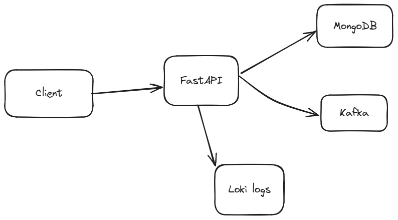
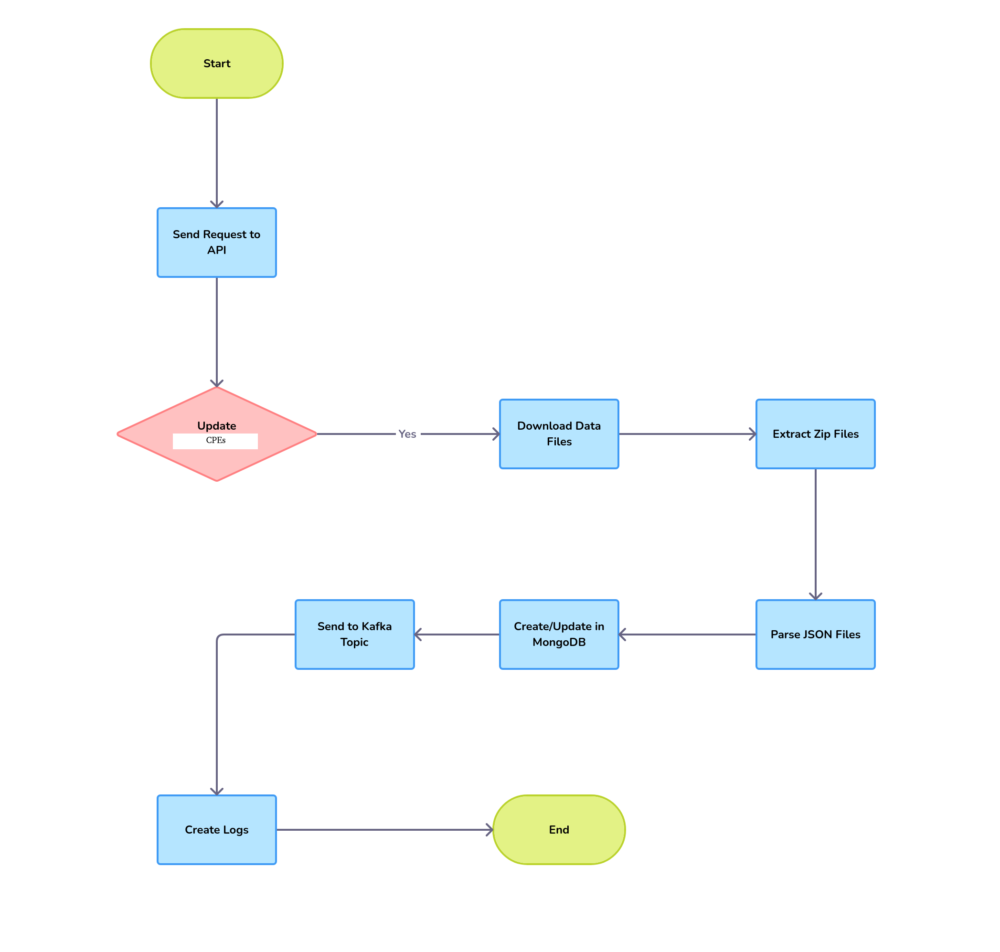

<div dir="rtl">

# پروژه CPE Scraper

این پروژه برای جمع‌آوری، دانلود و پردازش داده‌های CPE از پایگاه داده CPE طراحی شده است. داده‌ها پردازش شده و در یک پایگاه داده MongoDB ذخیره می‌شوند و لاگ‌گیری برای پیگیری پیشرفت و مدیریت خطاها پیاده‌سازی شده است.

## معماری پروژه 



## توضیحات فایل‌ها

### `auth.py`
تنظیمات مربوط به authentication در این فایل قرار دارد.

### `config.py`

تنظیمات مربوط به برنامه را شامل می‌شود، از جمله آدرس‌های URL برای دانلود داده‌های CPE.

### `crud.py`

عملیات پایگاه داده را با استفاده از Motor انجام می‌دهد. شامل توابعی برای ایجاد یا به‌روزرسانی CPE‌ها در مجموعه MongoDB. همچنین خطاهای اعتبارسنجی و دیگر استثناها را لاگ می‌کند.

### `database.py`

اتصال به پایگاه داده MongoDB را تنظیم می‌کند. شامل توابعی برای اتصال و قطع اتصال از پایگاه داده.

### `downloader.py`

دانلود فایل‌های داده CPE از آدرس‌های URL مشخص شده را انجام می‌دهد. شامل توابعی برای دانلود فایل‌ها به مکان مشخص شده است.

### `endpoints.py`

شامل نقطه‌های پایانی API برای به‌روزرسانی و بازیابی CPE‌ها است. شامل نقطه‌های پایانی برای به‌روزرسانی همه CPE، به‌روزرسانی CPEهای اخیر و تغییر یافته، و بازیابی همه CPE از پایگاه داده.

### `error_handler.py`

خطاها و استثناهایی که در طول اجرای برنامه رخ می‌دهند را مدیریت می‌کند. شامل توابع مدیریت خطای سفارشی است.

### `extractor.py`

استخراج فایل‌های زیپ دانلود شده حاوی داده‌های CPE را انجام می‌دهد. فایل‌ها را به یک دایرکتوری مشخص استخراج می‌کند.

### `health_check.py`
این فایل تمامی وابستگی ها و سلامت آنها را بررسی می کند.

### `kafka_producer.py`

یک تولیدکننده Kafka را برای ارسال هر داده CPE به یک تاپیک Kafka تنظیم می‌کند. شامل توابعی برای راه‌اندازی تولیدکننده و ارسال پیام‌ها است.

### `logger.py`

لاگ‌گیری برای برنامه را تنظیم می‌کند. برای هر فایل JSON یک فایل لاگ جداگانه ایجاد می‌کند تا پردازش CPE را پیگیری کند. اطمینان می‌دهد که دایرکتوری‌های لاگ وجود دارند و فرمت لاگ را پیکربندی می‌کند.

### `models.py`

مدل‌های MongoDB را با استفاده از Pydantic و PyMongo تعریف می‌کند. شامل مدل `CPEBase` که نمایانگر یک آیتم CPE است.

### `parser.py`

فایل‌های JSON استخراج شده از فایل‌های زیپ CPE را تجزیه می‌کند. داده‌های JSON را می‌خواند و هر آیتم CPE را پردازش می‌کند.

### `schemas.py`

مدل‌های Pydantic مورد استفاده برای اعتبارسنجی و سریال‌سازی داده‌ها را تعریف می‌کند. شامل مدل `CPEResponse` که نمایانگر یک آیتم CPE است.

### `Dockerfile`

تصویر Docker برای برنامه را تعریف می‌کند. محیط Python را راه‌اندازی می‌کند، وابستگی‌ها را نصب می‌کند و برنامه FastAPI را با استفاده از Uvicorn اجرا می‌کند.

### `docker-compose.yml`

پیکربندی Docker Compose برای پروژه را تعریف می‌کند. برنامه FastAPI و یک کانتینر MongoDB را راه‌اندازی می‌کند.

### `requirements.txt`

وابستگی‌های Python مورد نیاز برای پروژه را فهرست می‌کند.

## نحوه اجرای پروژه

### پیش‌نیازها

- Docker
- Docker Compose

### مراحل اجرا

1. **کلون کردن مخزن**


   ```sh
   git clone https://github.com/your-repo/cpe.git
   cd cpe
   ```
2. ساخت  Docker images

```
docker-compose build
```

اجرای کانتینرهای Docker

```
docker-compose up
```

این دستور برنامه FastAPI و کانتینر MongoDB را راه‌اندازی می‌کند. برنامه FastAPI در آدرس http://localhost:8000 قابل دسترسی خواهد بود.

نقطه‌های پایانی API

1. به‌روزرسانی همه CPE


POST http://localhost:8000/all

این نقطه پایانی همه فایل‌های سالیانه داده CPE را دانلود، استخراج و پردازش می‌کند.

2. به‌روزرسانی CPEهای اخیر و تغییر یافته


POST http://localhost:8000/recent

این نقطه پایانی فایل‌های داده اخیر و تغییر یافته CPE را دانلود، استخراج و پردازش می‌کند.

    
###لاگ‌ها

    فایل‌های لاگ برای هر فایل JSON پردازش شده در گرافانا ایجاد می‌شوند. این لاگ‌ها را بررسی کنید تا مشکلات را رفع کنید یا پیشرفت پردازش داده‌ها را پیگیری کنید.

###مدیریت خطا

    خطاهای اعتبارسنجی و استثناها در طول عملیات پایگاه داده در فایل‌های لاگ مربوط به هر فایل JSON پردازش شده لاگ می‌شوند.
    اطمینان حاصل کنید که سرویس MongoDB در حال اجرا است و توسط برنامه FastAPI قابل دسترسی است.

###جریان درخواست

    درخواست به یکی از نقطه‌های پایانی API ارسال می‌شود.
    اگر درخواست برای به‌روزرسانی CPE باشد، downloader.py فایل‌های داده را دانلود می‌کند.
    extractor.py فایل‌های زیپ دانلود شده را استخراج می‌کند.
    parser.py فایل‌های JSON استخراج شده را تجزیه می‌کند.
    crud.py آیتم‌های CPE را در پایگاه داده MongoDB ایجاد یا به‌روزرسانی می‌کند.
    هر آیتم CPE به یک تاپیک Kafka با استفاده از kafka_producer.py ارسال می‌شود.
    لاگ‌ها با استفاده از logger.py برای پیگیری پیشرفت و مدیریت خطاها ایجاد می‌شوند.



</div>